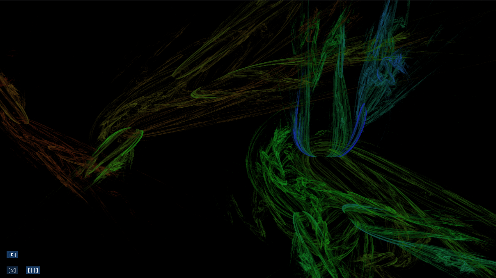
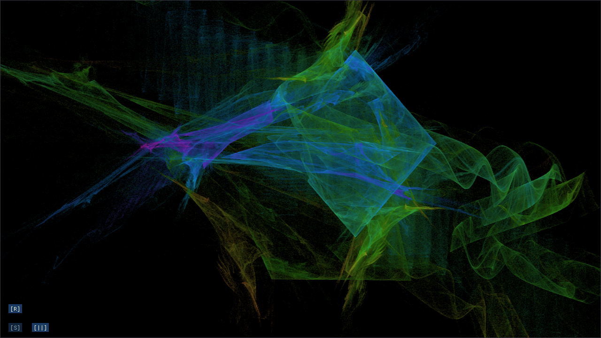

# Fractal Flame Renderer

A real-time fractal flame renderer, built to compare different parallel computing backends -- OpenMP, MPI, and CUDA backends.

Fractal flames are a class of iterated function system (IFS) fractals, introduced by Scott Draves and Erik Reckase.  They work by taking a coordinate, and then repeatedly applying randomly chosen transformations -- all of them are defined at the bottom of the linked [paper](https://flam3.com/flame_draves.pdf).  These coordinates are logged in a histogram.  Tone-mapping the result with a logarithm (take the log of the number of hits of each pixel) makes a cool, complex visual effect:





## Building

### Dependencies
- CMake 3.x+
- Minimum C++11 (due to std::chrono, std::thread)
- OpenGL (libgl1-mesa-dev)
- GLFW (Wayland): libwayland-dev, wayland-protocols, libxkbcommon-dev
- GLFW (X11): libxrandr-dev, libxinerama-dev, libxcursor-dev, libxi-dev

### Build instructions

1. Install dependencies
```shell
$ sudo apt update
$ sudo apt install -y libwayland-dev build-essential wayland-protocols libxkbcommon-dev libxrandr-dev libxinerama-dev libxcursor-dev libxi-dev libgl1-mesa-dev
```

2. Clone the repository
```shell 
$ git clone https://github.com/eli334/Fractal_Flame.git
```
- Inside the repo:
```shell 
$ mkdir build && cd build
$ cmake ..
```
- To develop / rebuild (in /build):
```shell
$ make
```


## Roadmap

- 1.1 - Naive threading
- 1.2 - OpenMP
- 1.3 - CUDA
- 1.4 - MPI


## Credits and Acknowledgements

This project was developed as part of the [SHREC](https://www.nsf-shrec.org/) SURG program at the University of Pittsburgh.

https://flam3.com/flame_draves.pdf -- paper by Scott Draves and Erik Reckase

The bulk of my implementation is based on this paper, so thank you Scott Draves and Erik Reckase!


https://github.com/glfw/glfw

https://github.com/dav1dde/glad

https://github.com/ocornut/imgui